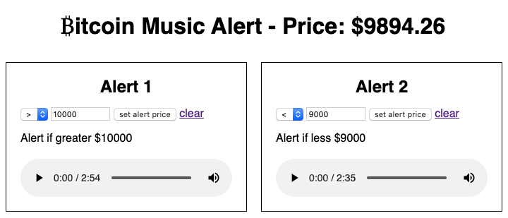

# Bitcoin Music Price Alert

Makes use of Bitstamp &/or MercadoBitcoin API to play a song when the price hits your alert settings in USD or BRL. MIT License. Have fun!

## Documentation

Changing songs: name your music file indicating which alert it connects with, such as alert-1.mp3 and drag it into the folder to replace the old mp3 file. Name alert-2.mp3 for alert 2, and alert-3.mp3 for alert 3.

## Resources
- [https://www.bitstamp.net/api/](https://www.bitstamp.net/api/)
- [https://www.mercadobitcoin.com.br/api-doc/](https://www.mercadobitcoin.com.br/api-doc/)
- [https://currency.js.org/](https://currency.js.org/)
- [https://jquery.com/](https://jquery.com/)
